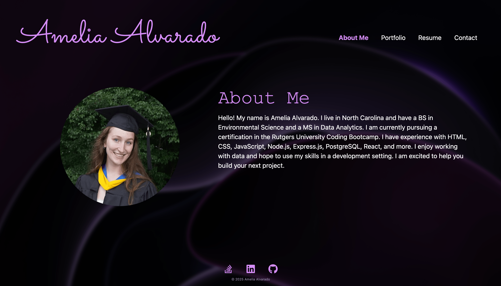

# Amelia's Portfolio (React)


## Description

This portfolio site was built with React and features an About Me section, project portfolio, resume, and contact form. It serves as both a personal introduction and a professional hub where potential employers and fellow developers can explore my background, skills, and projects.

In a recent update, I added a Python-based back end using FastAPI and SQLAlchemy. This allows users to submit contact information through a form, with the data stored securely in a relational database. This was my first time working with FastAPI, and it gave me valuable hands-on experience building and connecting a RESTful API using Python.

Through this project, I gained experience with component-based architecture, code modularization, full-stack integration, and modern development tools and libraries. It reflects my ability to work across both the front and back end of a web application and my eagerness to learn new technologies.

## Table of Contents

- [Live Site](#live-site)
- [Installation](#installation)
- [Usage](#usage)
- [Credits](#credits)
- [License](#license)
- [Contact](#contact)

## Live Site

👉 [Visit the Portfolio](https://amelia-alvarado.netlify.app/)

## Installation

This application is accessible in any modern web browser using the link provided in the [Live Site](#live-site) section. No installation is required to view the deployed portfolio.

To run the project locally:

### Front-End Installation (React)

1. Open your terminal and navigate to where you would like to store this repo on your device.

2. Clone the repo:

   ```sh
   git clone https://github.com/amelia1105/amelias-portfolio-react.git
   ```

3. Navigate into the project folder:

   ```sh
   cd amelias-portfolio-react
   ```

4. Navigate into the client folder:

   ```sh
   cd client
   ```

5. Install dependencies:

   ```sh
   npm install
   ```

6. Build the app:

   ```sh
   npm run build
   ```

7. Start the development server (default: port 3000):

   ```sh
   npm run start
   ```

### Back-End Installation (FastAPI + SQLAlchemy + PostgreSQL)

1. Ensure you have **Python 3.8+**, **pip**, and **PostgreSQL** installed.

2. Create and activate a virtual environment:

   ```sh
   python -m venv venv
   source venv/bin/activate  # On Windows: venv\Scripts\activate
   ```

3. Navigate to the server directory:

   ```sh
   cd server
   ```

4. Install the required Python packages:

   ```sh
   pip install -r requirements.txt
   ```

   or

   ```sh
   pip3 install -r requirements.txt
   ```

5. Rename the .env.EXAMPLE file to .env, and provide your PostgreSQL database username and password in DB_USERNAME and DB_PASSWORD. Make sure the host and port match your PostgreSQL setup.

6. Start the FastAPI server:

   ```sh
   uvicorn app.main:app --reload
   ```

## Usage

### Front End

- Open your browser and navigate to [http://localhost:3000](http://localhost:3000) (or the deployed Netlify URL).
- Use the navigation bar to browse sections like About Me, Portfolio, Resume, and Contact.
- Use the contact form to submit a message. This sends a request to the FastAPI back end.



### Back End

- Once the FastAPI server is running, it listens at `http://localhost:8000`.
- Form submissions are handled via REST endpoints and stored in a PostgreSQL database using SQLAlchemy.
- To explore the API, visit the interactive documentation:

  ```
  http://localhost:8000/docs
  ```

## Credits

This project was created with support from the following:

- **Frameworks/Libraries:** React, React Bootstrap, Bootstrap CSS, React Icons
- **Starter Code & References:** Source structure and navigation logic inspired by the `23-Ins_React-Router` module from Rutgers University Coding Bootcamp
- **Design Inspiration:** [Soumyajit Behera’s portfolio](https://soumyajit.vercel.app/)
- **Background Image:** Photo by Pawel Czerwinski on [Unsplash](https://unsplash.com/photos/a-purple-abstract-background-with-curves-1A_dO4TFKgM)
- **AI Assistants:** GitHub Copilot and ChatGPT for coding guidance

All other code was developed by me.

## License

This project is licensed under the MIT License. See the LICENSE section for more details.

## Contact

For questions, collaboration opportunities, or feedback, feel free to reach out:

📧 ameliabalvarado@gmail.com
