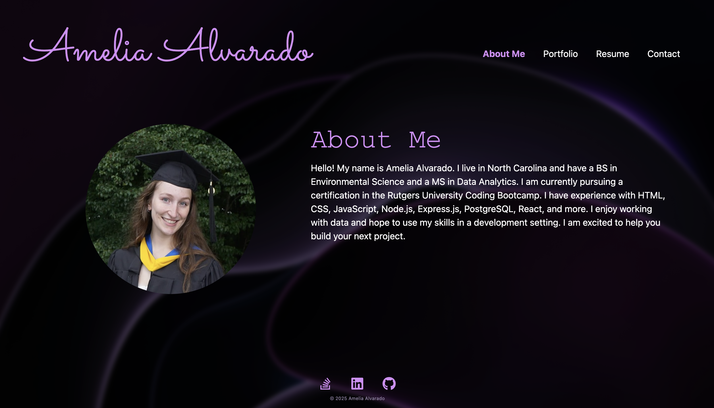

# Amelia's Portfolio (React)


## Description

This project involves creating a portfolio that consists of an About Me section, a Portfolio section, a Resume section, and a Contact section. This portfolio was developed using React. As a future software developer, having a portfolio will not only help me standout among other candidates, but it will also help me connect with other developers in the community. Further, I will be able to provide concrete examples of my skills by simply directing employers to my website. I learned a lot while creating this project, like how React components interact with each other, how to modularize code, and how to integrate React component libraries into my code.

## Table of Contents

- [Link to Application](#link-to-application)
- [Installation](#installation)
- [Usage](#usage)
- [Credits](#credits)
- [License](#license)
- [Questions](#questions)

## Link to Application

[Amelia's Portfolio](https://amelia-alvarado.netlify.app/)

## Installation

This application is accessible in any web browser using the link above. No installation is required.

To install the application on your local device for editing or to view the repo, perform the following steps:

1. In the terminal, navigate to where you would like the repo to be stored on your device.

2. Clone the repo to your device using the following:

    ```sh
    git clone https://github.com/amelia1105/amelias-portfolio-react.git
    ```

3. Switch into the amelias-portfolio-react directory. 

    ```sh
    cd amelias-portfolio-react
    ```

4. In the command line, install dependencies using the following:

    ```sh
    npm install
    ```

## Usage

The application can be used in a web browser. Use the link in [Link to Application](#link-to-application) to access the page in any browser.

1. The link will take you to the home page for my portfolio.

    

2. Use the tabs at the top right to navigate to the other pages. Use the links at the bottom to connect with me on StackOverflow, LinkedIn, and GitHub.

If you have loaded the repository onto your local device:

1. Run the application using the following command. Note that the repository is set up to run on port 3000. You may need to change the port or check if you are running anything on port 3000.

    ```sh
    npm run dev
    ```

## Credits

Although no starter code was provided for this assignment, I used some files from other projects to get started. I initially created a Vite project and then used the source code from the 23-Ins_React-Router assignment to get my React component interactions and navigation tabs set up (in GitLab, [RUT-VIRT-FSF-PT-10-2024-U-LOLC](https://git.bootcampcontent.com/Rutgers-University/RUT-VIRT-FSF-PT-10-2024-U-LOLC) > 12-React > 01-Activities > 23-Ins_React-Router). I used React Bootstrap components, Bootstrap CSS, and React Icons throughout the project. The background photo is from Pawel Czerwinski on [Unsplash](https://unsplash.com/photos/a-purple-abstract-background-with-curves-1A_dO4TFKgM?utm_content=creditCopyText&utm_medium=referral&utm_source=unsplash). I was inspired by the design of another developer's portfolio, [Soumyajit Behera](https://soumyajit.vercel.app/), and used a similar color scheme in my project. All other code was developed by myself with the assistance of GitHub Copilot and ChatGPT.

## License

MIT License

Copyright (c) 2025 Amelia Alvarado

Permission is hereby granted, free of charge, to any person obtaining a copy
of this software and associated documentation files (the "Software"), to deal
in the Software without restriction, including without limitation the rights
to use, copy, modify, merge, publish, distribute, sublicense, and/or sell
copies of the Software, and to permit persons to whom the Software is
furnished to do so, subject to the following conditions:

The above copyright notice and this permission notice shall be included in all
copies or substantial portions of the Software.

THE SOFTWARE IS PROVIDED "AS IS", WITHOUT WARRANTY OF ANY KIND, EXPRESS OR
IMPLIED, INCLUDING BUT NOT LIMITED TO THE WARRANTIES OF MERCHANTABILITY,
FITNESS FOR A PARTICULAR PURPOSE AND NONINFRINGEMENT. IN NO EVENT SHALL THE
AUTHORS OR COPYRIGHT HOLDERS BE LIABLE FOR ANY CLAIM, DAMAGES OR OTHER
LIABILITY, WHETHER IN AN ACTION OF CONTRACT, TORT OR OTHERWISE, ARISING FROM,
OUT OF OR IN CONNECTION WITH THE SOFTWARE OR THE USE OR OTHER DEALINGS IN THE
SOFTWARE.

## Questions

For any questions about this project, please contact me by email: ameliabalvarado@gmail.com